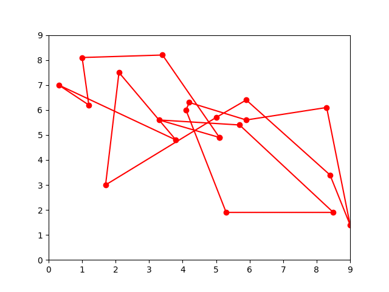
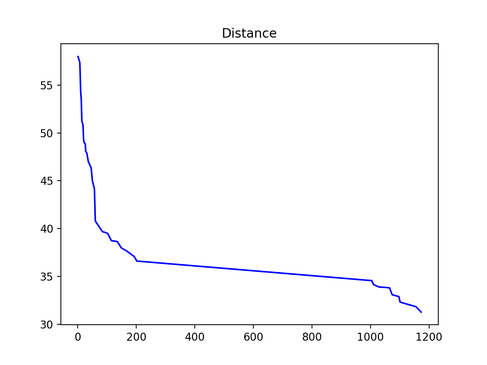
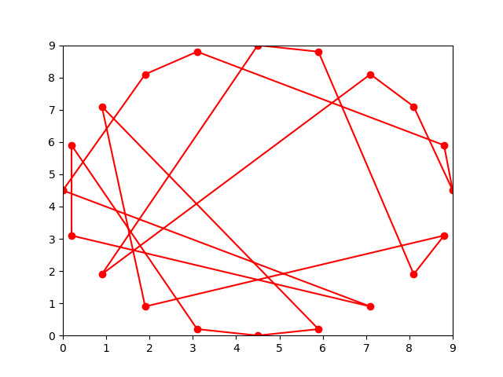
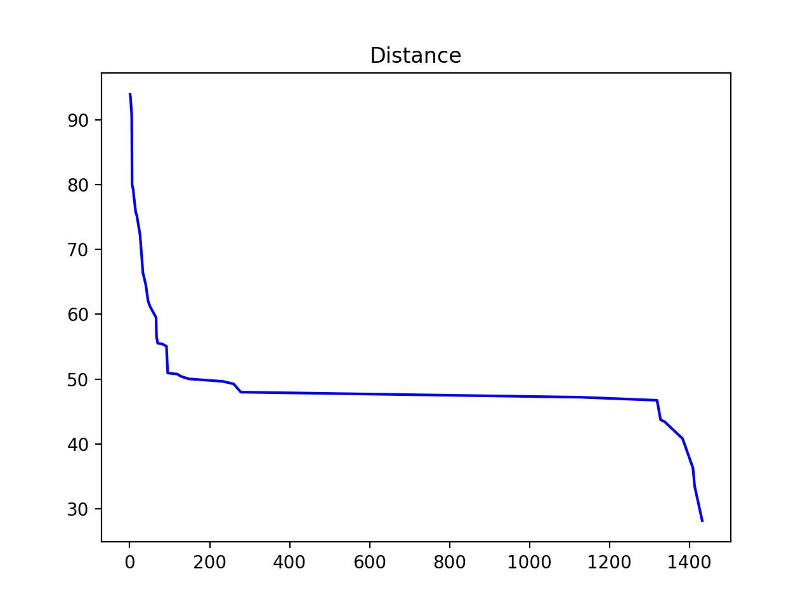
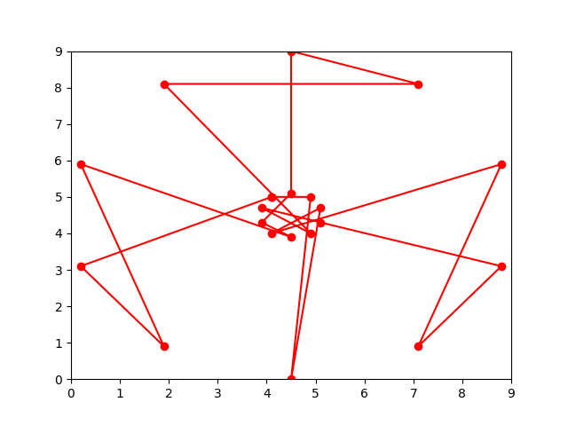
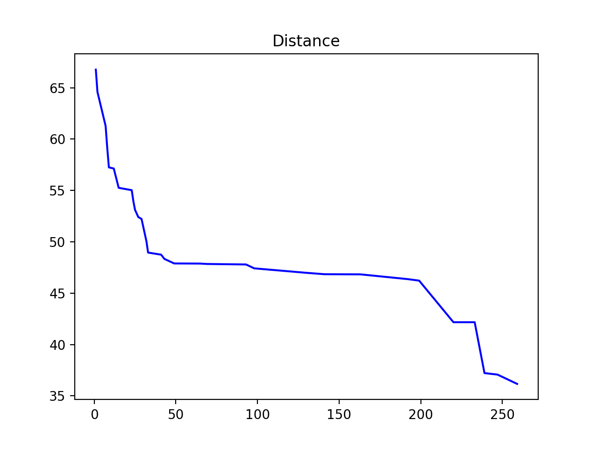

# Traveling Salesman problem with Genetic Algorithms

To understand the Mutation and Crossover functions, please refer to [this](http://www.theprojectspot.com/tutorial-post/applying-a-genetic-algorithm-to-the-travelling-salesman-problem/5) link.

## Random locations

## Circular locations

## Two circles locations
This problem is usually a bit harder to optimize.

## Technical details
I added the 1-circle and 2-circle locations because it's known which way is the optimal one.

**Note**: The distance graph doesn't track duplicant points.
**Note**: This project uses C# **and** Python3.
